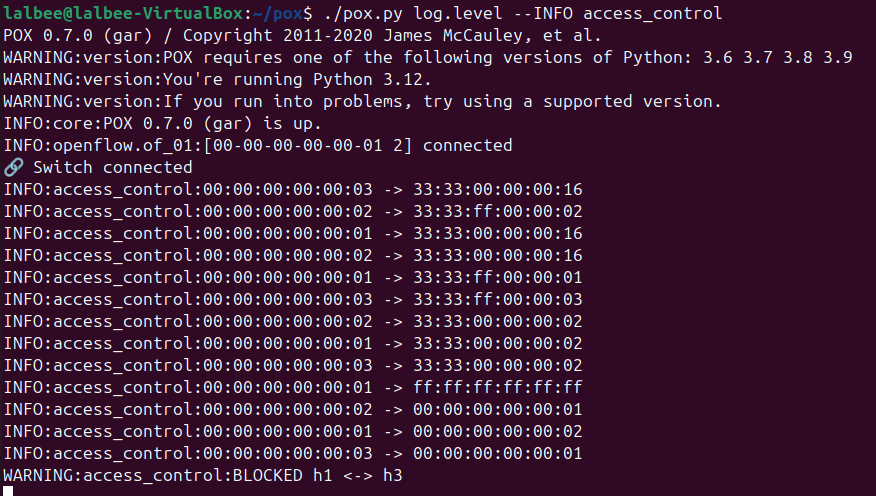
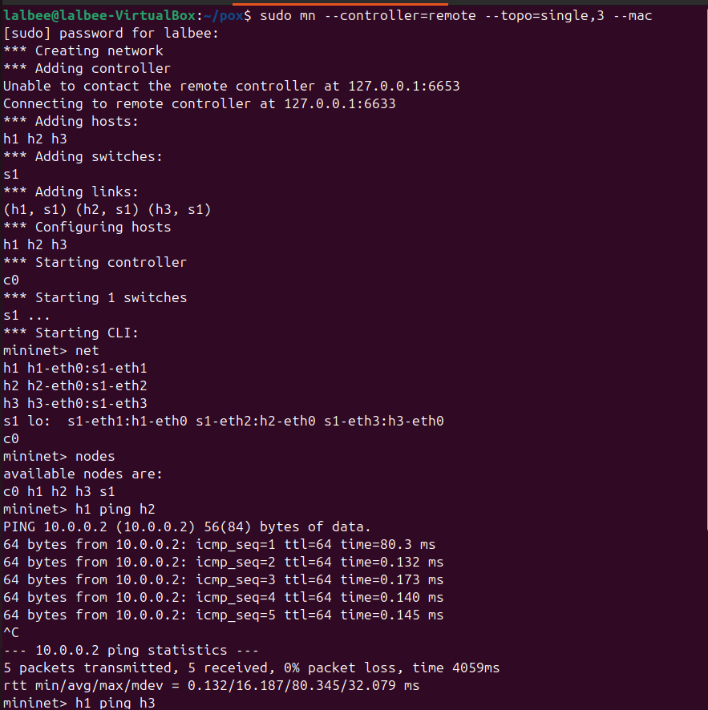
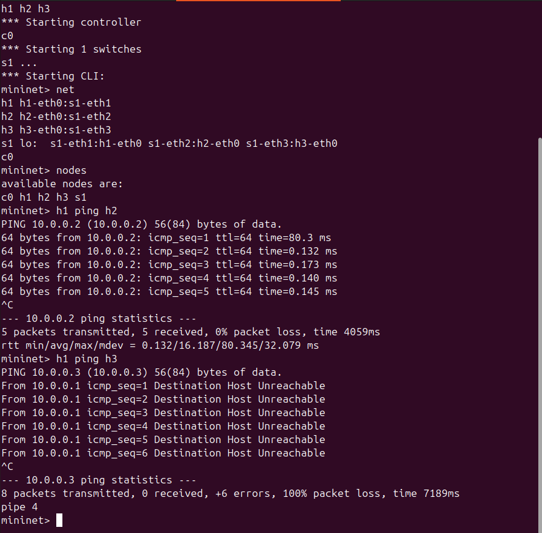
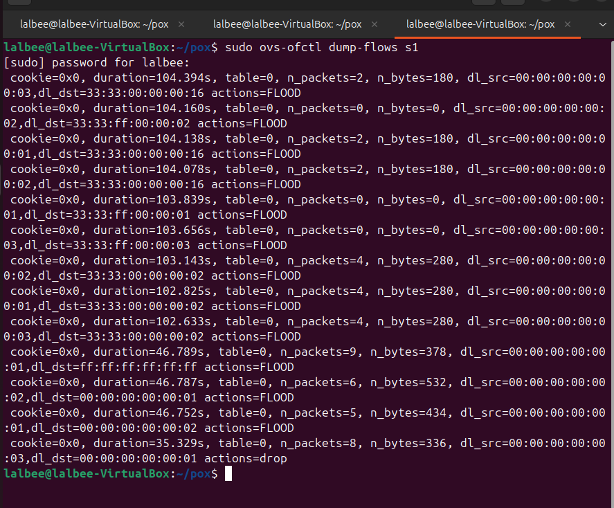

# SDN-Based Access Control System

## Abstract

This project implements an SDN-based access control system using POX controller and Mininet. It selectively allows and blocks communication between hosts by installing flow rules in the switch.

## Objective

* Allow: h1 ↔ h2
* Block: h1 ↔ h3

## Setup

1. Start POX:
   ./pox.py log.level --INFO access_control

2. Start Mininet:
   sudo mn --controller=remote,ip=127.0.0.1,port=6633 --topo=single,3 --mac

## Results

* h1 → h2: SUCCESS
* h1 → h3: BLOCKED

## Flow Table

Example:
actions=drop

## Conclusion

SDN controller successfully enforces access control policies using flow rules.
## Screenshots

### POX Controller Logs

### Allowed Communication (h1 → h2)

### Blocked Communication (h1 → h3)

### Flow Table (Drop Rule)

